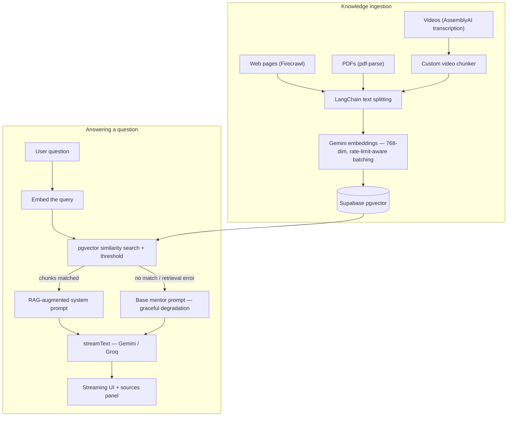

<div align="center">

# DevMentor AI

**An Arabic-first AI mentor for React/Next.js developers — answers grounded in real documentation, not hallucinations.**

[**Live App**](https://devmentor-ai-beta.vercel.app/en) · [Architecture](#how-it-works) · [Engineering decisions](#engineering-decisions) · [Running locally](#running-locally)

    

**Status:** private beta — 41 developers signed up

</div>

<!-- DEMO GIF GOES HERE
Record a 30–60s screen capture showing:
  1. Ask a question in Arabic → answer streams in with the sources panel open
  2. Paste a code snippet → get a review with explanation + fix
Tools: ScreenToGif (Windows) or Kap (Mac). Keep it under 10 MB,
save as public/demo.gif, then replace this comment with:

-->

---

## Why I built this

I mentor 80+ junior developers at Elevate Tech, doing 20–50 code reviews a week. Two problems kept repeating:

1. **Juniors wait hours for answers** a mentor could give in minutes — and generic chatbots confidently hallucinate APIs that don't exist in the framework version they're using.
2. **Arabic-speaking developers are underserved.** Almost every AI dev tool assumes English-first users.

DevMentor AI is my answer: a mentor that responds **only from curated, real documentation**, shows you exactly which sources it used, reviews your code — and speaks Arabic natively.

## What it does

- **Documentation-grounded chat (RAG)** — answers come from an ingested knowledge base, with a **retrieval-insights panel** showing the matched sources and their similarity scores, so you can verify instead of trust.
- **Multi-format knowledge ingestion** — feed it web pages (Firecrawl), PDFs, or **videos** (transcribed via AssemblyAI and chunked with a custom video chunker).
- **AI code review** — paste code, get issues flagged, explained, and corrected.
- **Stack-aware onboarding** — pick your Next.js/React versions so answers match *your* stack.
- **Streaming everything** — markdown, code blocks with syntax highlighting, rendered as tokens arrive.
- **Bilingual by design** — full Arabic/English UI with proper RTL support.
- **Persistent sessions** — conversations are saved and resumable.

## How it works



The full request lifecycle: the chat page sends messages to `POST /api/chat`, which runs the RAG pipeline (`src/lib/ai/rag.ts`) to build a context-augmented system prompt, then streams the model's response back through the Vercel AI SDK. Deep-dive flow documentation lives in [`docs/flows/`](docs/flows/).

## Engineering decisions

**Graceful degradation over hard failure.** If retrieval fails (e.g., a transient pgvector error), the chat falls back to the base mentor prompt instead of returning a 500 — a working answer without fresh context beats a dead chat.

**No silent provider fallback.** The chat provider catalog (`src/lib/ai/providers.ts`) supports Gemini and Groq, but switching is explicit. If the active provider fails, the request fails visibly — silent retries hide real problems.

**Retrieval quality is measured, not assumed.** A question-set evaluation harness (`yarn kb:eval`) scores retrieval against expected sources, and `yarn kb:integrity` checks the knowledge base for broken or orphaned chunks.

**Embeddings tuned for the workload.** Gemini `gemini-embedding-001` at 768 output dimensions, with batched `embedMany` calls that respect provider rate limits.

**Rate limiting at the route level** protects the free beta from abuse without degrading the experience for normal use.

## Tech stack

| Layer | Choice |
|---|---|
| Framework | Next.js 16 (App Router) · React 19 · TypeScript |
| AI orchestration | Vercel AI SDK v6 (`streamText`, `embed`, `embedMany`) |
| Chat models | Google Gemini · Groq (provider catalog with per-model capabilities) |
| Embeddings | Gemini `gemini-embedding-001` (768-dim) |
| Vector store | Supabase Postgres + pgvector |
| Ingestion | Firecrawl (web) · pdf-parse (PDF) · AssemblyAI (video) · LangChain text splitters |
| Auth & data | Supabase (SSR auth, sessions, knowledge base) |
| UI | Tailwind v4 · shadcn/radix · Streamdown (streaming markdown) · Shiki (code highlighting) |
| i18n | next-intl — Arabic/English with RTL |

## Project structure

```
src/
├── app/
│   ├── [locale]/          # landing · login · chat/[[...sessionId]] · upload
│   └── api/chat/          # the streaming chat endpoint (RAG entry point)
├── components/
│   ├── features/          # auth · landing · upload · chat (incl. sources panel)
│   └── ai-elements/       # streaming-aware UI primitives
├── lib/
│   ├── ai/                # rag · embeddings · search · chunking · providers ·
│   │                      # prompts · memory · rate-limit · video-chunker
│   ├── actions/ services/ # server actions & data access
│   └── utils/supabase/    # SSR client/server helpers
└── messages/              # en.json · ar.json
scripts/                   # kb-integrity.ts · kb-retrieval-eval.ts · eval questions
docs/flows/                # per-feature flow documentation
```

## Running locally

**Prerequisites:** Node 20+, Yarn, and a Supabase project with the pgvector extension enabled.

```bash
git clone https://github.com/Shamsmedhat/devmentor-ai
cd devmentor-ai
yarn
cp .env.example .env.local   # then fill in your keys (see below)
yarn dev
```

| Variable | What it's for |
|---|---|
| `NEXT_PUBLIC_SUPABASE_URL` | Your Supabase project URL |
| `NEXT_PUBLIC_SUPABASE_PUBLISHABLE_KEY` | Supabase publishable (client) key |
| `SUPABASE_SERVICE_ROLE_KEY` | Server-side Supabase access |
| `GOOGLE_GENERATIVE_AI_API_KEY` | Gemini — chat + embeddings ([aistudio.google.com](https://aistudio.google.com)) |
| `GROQ_API_KEY` | Optional second chat provider ([console.groq.com](https://console.groq.com)) |
| `FIRECRAWL_API_KEY` | URL ingestion ([firecrawl.dev](https://firecrawl.dev)) |
| `ASSEMBLYAI_API_KEY` | Video transcription ([assemblyai.com](https://assemblyai.com)) |
| `OWNER_EMAIL` | Admin/owner account email |

Knowledge-base tooling:

```bash
yarn kb:integrity   # check the knowledge base for broken/orphaned chunks
yarn kb:eval        # score retrieval quality against the eval question set
```

> **Note:** the database schema (knowledge-base tables + the pgvector match function) isn't bundled as migrations yet — it's on the roadmap below. Until then the live app is the best way to try DevMentor.

## Roadmap

- [x] RAG pipeline with multi-format ingestion (web, PDF, video)
- [x] Streaming chat with sources panel, sessions, AR/EN + RTL
- [x] Retrieval evaluation harness
- [ ] UI polish pass and open the beta to the 41-developer waitlist
- [ ] Bundle Supabase schema as migrations for one-command setup
- [ ] Expand the knowledge base across the supported stack versions

## About me

I'm **Shams Medhat**, a frontend engineer (React / Next.js / TypeScript, full-stack capable) based in Giza, Egypt — currently mentoring 80+ developers at Elevate Tech.

[LinkedIn](https://www.linkedin.com/in/shamsmedhat/) · [GitHub](https://github.com/Shamsmedhat) · [DevMentor AI live](https://devmentor-ai-beta.vercel.app/en)
